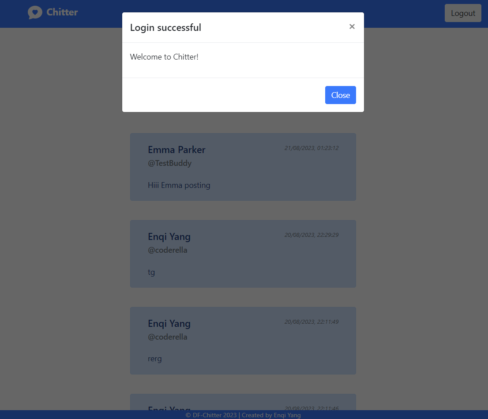
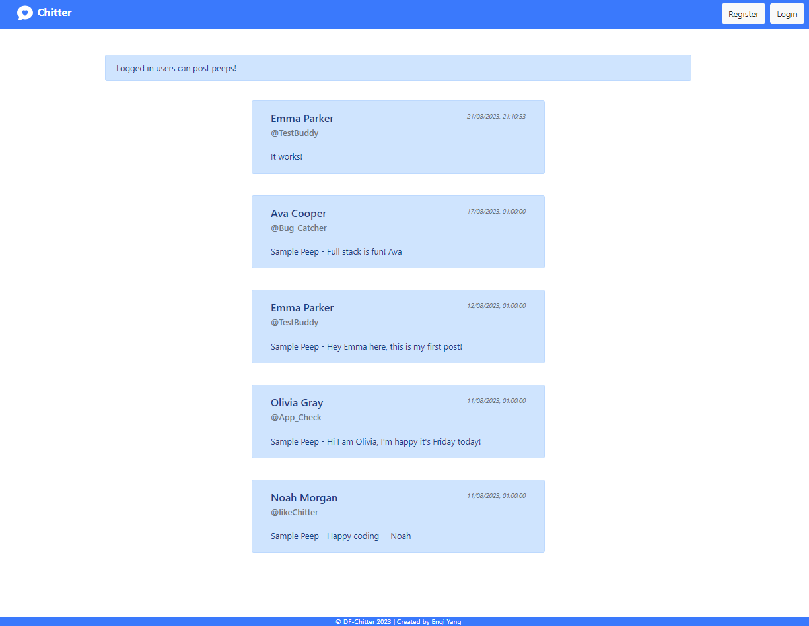
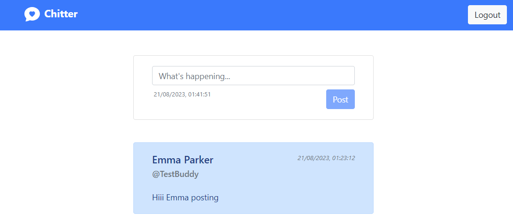
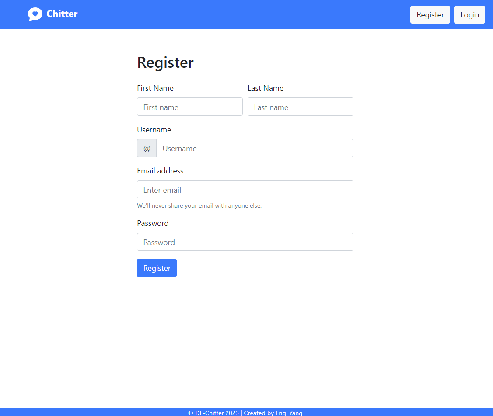
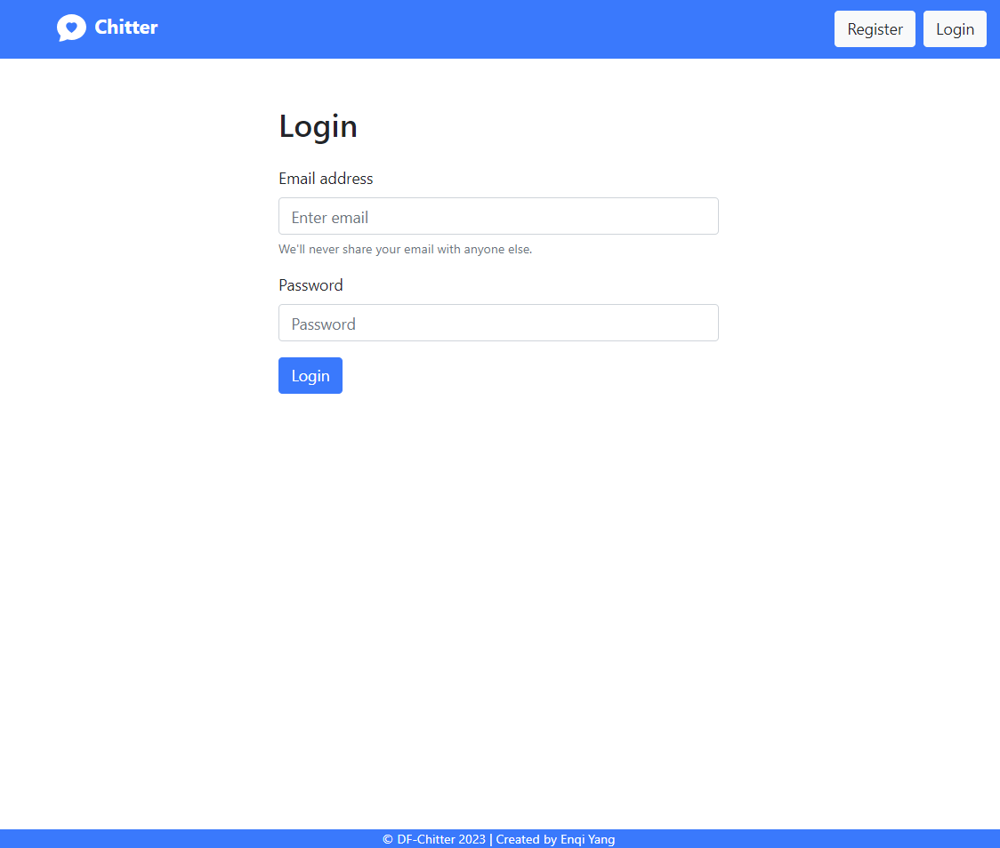
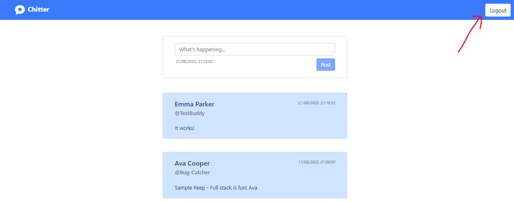

# Chitter - Twitter Clone

Chitter is a simplified Twitter clone that allows users to post messages (peeps) to a public wall. It's a full-stack web application built using the MERN (MongoDB, Express.js, React.js, Node.js) stack.

#### Table of Contents

- [Features](#Features)
- [Technologies Used](#Technologies-Used)
- [Usage](#Usage)
- [License](#Acknowledgement)
- [Contact](#Further-Improvement)

## Features

#### View Peeps:

Users can view all peeps in reverse chronological order without the need to log in.

#### Post Peeps:

Registered users can post messages to share their thoughts or updates. The peep will be display once it's posted

#### Timestamps:

Peeps display the time at which they were created.

#### User Registration:

Trainee software engineers can sign up for Chitter with their email, password, name, and username. Email and username must be unique.

 | 

#### User Authentication:

Registered users can log in to Chitter to post messages with the right email and password.

 | 

#### User Logout:

Users can log out of their Chitter accounts.

## Technologies Used

#### MongoDB

MongoDB is used as the primary database to store user data, peeps (posts).

#### Express.js

Express.js is utilized to build the RESTful API server for Chitter.

#### React.js

React.js is used for developing the front-end user interface of the application.

#### Node.js

Node.js serves as the runtime environment for the server-side code.

#### Bootstrap

Bootstrap is used in designing, styling all the layout and components of Chitter's web pages.

## Usage

### Prerequisites

- Node.js: You can download and install Node.js from [nodejs.org](https://nodejs.org/enk).
- MongoDB: Install MongoDB locally or use a cloud-based MongoDB service like MongoDB Atlas. You can download MongoDB from [mongodb.com](https://www.mongodb.com/).

### Installation

1. Clone this repository to your local machine using Git, and change your current directory to the project directory.

   `git clone https://github.com/coder3114/chitter-challenge.git`

   `cd chitter-challenge`

1. Inside the project directory, navigate to the server folder and install the server-side dependencies.

   `cd ../chitterBackEnd`

   `npm install`

1. Navigate to the client/frontend folder and install the client-side dependencies.

   `cd ../chitterFrontEnd`

   `npm install`

1. Create a .env file in the client/frontend directory for API call.

   `VITE_PEEPSURL=<your-API-connection-string>`

1. Create a .env file in the server/backend directory and configure your MongoDB connection string and any other environment variables you uses.

   `PORT=<server-port>`

   `HOST=<server-host>`

   `DB_URI=<your-mongodb-connection-string>`

1. Database Setup and ensure your MongoDB server is running.

### Running the Application

1. In the server directory, start the Node.js server. The server should start and listen on the port specified in your .env file.

   `npm start` or
   `npm start-win`

1. In the client directory, start the React development server. This will open your web application in a web browser.

   `npm run dev`

1. Open your web browser and navigate to http://localhost:<port> to access the application.

### Running Tests

1. In the server directory, run server-side tests.

   `npm test`

1. In the client directory, run client-side tests.

   `npm run test`

## Acknowledgement

Below is a list of sources that contributed to the development of this app, and I'd like to give credit to.

- [DigitalFutures/SE-2306-A-Demos/FullStackEngineering/](https://github.com/digital-futures-academy/SE-2306-A-Demos/tree/main/FullStackEngineering)

- [Bootstrap Form Validation](https://getbootstrap.com/docs/5.0/forms/validation/)

- [Using insertOne() in Mongoose](https://masteringjs.io/mongoose)

- [How to Redirect a User After Login in React](https://www.makeuseof.com/redirect-user-after-login-react/)

- [Error: Can't set headers after they are sent to the client](https://stackoverflow.com/questions/7042340/error-cant-set-headers-after-they-are-sent-to-the-client)

- [How to Create a Registration Form using React.js and Connect it to Firebase](https://www.section.io/engineering-education/registration-form-react.js-firebase/)

- [Mock.mockImplementation is not a function](https://stackoverflow.com/questions/67210131/mock-mockimplementation-is-not-a-function)

## Further Improvement

- Hash and verify password with bcrypt.
- Implement React.js JWT authentication for Login and Registration.
- Resolve mockImplementation and mockResolvedValueOnce errors for frontend App test.
- Deploy to a cloud-based MongoDB service like MongoDB Atlas
